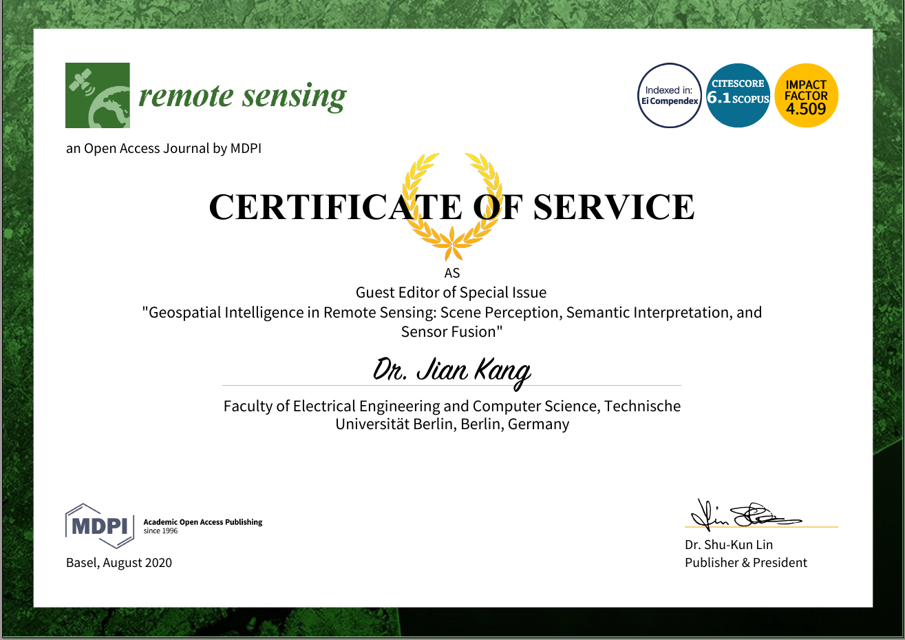

Jian Kang (康健) is a Postdoc researcher with the Faculty of Electrical Engineering and Computer Science, by [Technische Universität Berlin](https://www.tu-berlin.de/menue/home/). His research interest includes signal processing and machine learning, especially their applications in remote sensing. He received Dr.-Ing. at [SiPEO](https://www.sipeo.bgu.tum.de/) by [Technische Universität München](https://www.tum.de/en/), 2019, supervised by [Prof.Dr.-Ing.habil.Xiaoxiang Zhu](https://www.sipeo.bgu.tum.de/team/zhu). From August to September of 2018, he was a guest researcher at [Institute of Computer Graphics and Vision (ICG)](https://www.tugraz.at/institutes/icg/home/), TU Graz, Graz, Austria. He received M.Eng. and B.Eng. in Electronic and Information Engineering, [Harbin Institute of Technology](http://en.hit.edu.cn/), 2015 and 2013, supervised by [Prof.Yong Wang](http://homepage.hit.edu.cn/wangyong6012).   

Activities
======

* [11/2020] 参加第三届“城市遥感”学术研讨会并做线上报告, 上海, 2020.

* [06/2020] Served as the **Guest Editor** of MDPI Remote Sensing Special Issue: [Geospatial Intelligence in Remote Sensing: Scene Perception, Semantic Interpretation, and Sensor Fusion](https://www.mdpi.com/journal/remotesensing/special_issues/Geospatial_Intelligence).

* [06/2020] Joint work "Sun Glint Removal of Hyperspectral Images via Texture-aware Total Variation" is selected as one of the **10 Student Paper Competition Finalists** in IGARSS 2020.

* [09/2019] Successfully gave my PhD defense in TUM, with the title of "**Object-based Multibaseline SAR Interferometry**".

* [06/2018] Obtained 1st place of best student paper award in EUSAR 2018, with the paper of "**Low Rank Modeling-based Multipass InSAR Technique**"

<!-- 
Full Publications
======
### Journal paper:

1. Wang, Y., **Kang, J.**, & Jiang, Y. (2014). ISAR imaging of maneuvering target based on the local polynomial Wigner distribution and integrated high-order ambiguity function for cubic phase signal model. <i>IEEE Journal of Selected Topics in Applied Earth Observations and Remote Sensing</i>, 7(7), 2971-2991.
2. Wang, Y., Zhao, B., & **Kang, J**. (2014). Asymptotic statistical performance of local polynomial Wigner distribution for the parameters estimation of cubic-phase signal with application in ISAR imaging of ship target. <i>IEEE Journal of Selected Topics in Applied Earth Observations and Remote Sensing</i>, 8(3), 1087-1098.
3. Wang, Y., & **Kang, J.** (2015). Parameter estimation for rigid body after micro-Doppler removal based on L-statistics in the radar analysis. <i>Journal of Systems Engineering and Electronics</i>, 26(3), 457-467.
4. **Kang, J**., Wang, Y., Körner, M., & Zhu, X. X. (2017). Robust object-based multipass InSAR deformation reconstruction. <i>IEEE Transactions on Geoscience and Remote Sensing</i>, 55(8), 4239-4251.
5. **Kang, J**., Wang, Y., Schmitt, M., & Zhu, X. X. (2018). Object-based multipass InSAR via robust low-rank tensor decomposition. <i>IEEE Transactions on Geoscience and Remote Sensing</i>, 56(6), 3062-3077. [**Selected as Journal Cover**]
6. **Kang, J**., Körner, M., Wang, Y., Taubenböck, H., & Zhu, X. X. (2018). Building instance classification using street view images. <i>ISPRS journal of photogrammetry and remote sensing</i>, 145, 44-59.
7. Zhang, B., Zhang, M., **Kang, J**., Hong, D., Xu, J., & Zhu, X. (2019). Estimation of PMx Concentrations from Landsat 8 OLI Images Based on a Multilayer Perceptron Neural Network. <i>Remote Sensing</i>, 11(6), 646.
8. Hoffmann, E. J., Wang, Y., Werner, M., **Kang, J**., & Zhu, X. X. (2019). Model Fusion for Building Type Classification from Aerial and Street View Images. <i>Remote Sensing</i>, 11(11), 1259.
9. Danfeng Hong, Jocelyn Chanussot, Naoto Yokoya, **Jian Kang**, Xiaoxiang Zhu. Learning Shared Cross-modality Representation Using Multispectral-LiDAR and Hyperspectral Data, <i>IEEE Geoscience and Remote Sensing Letters</i>, 2019. (Accepted)
10. **Jian Kang**, Yuanyuan Wang, Xiaoxiang Zhu. Multipass SAR Interferometry Based on Total Variation Regularized Robust Low Rank Tensor Decomposition. <i>IEEE Transactions on Geoscience and Remote Sensing</i>, 2019. (Accepted) 
11. Xiao Xiang Zhu, Jingliang Hu, Chunping Qiu, Yilei Shi, **Jian Kang**, Lichao Mou, Hossein Bagheri, Matthias Häberle, Yuansheng Hua, Rong Huang, Lloyd Hughes, Hao Li, Yao Sun, Guichen Zhang, Shiyao Han, Michael Schmitt, Yuanyuan Wang, So2Sat LCZ42: A Benchmark Dataset for Global Local Climate Zones Classification. <i>IEEE Geoscience and Remote Sensing Magazine</i>, 2019. (Accepted)

### Conference paper:

1. Wang, Yong, **Jian Kang**, and Runbin Zhang. "ISAR imaging with random missing observations based on non-iterative signal reconstruction algorithm." 2014 12th *International Conference on Signal Processing* (ICSP). IEEE, 2014.

2. Wang, Yong, Runbin Zhang, and **Jian Kang**. "Rotational parameters estimation for ISAR imaging of maneuvering target." 2014 12th *International Conference on Signal Processing* (ICSP). IEEE, 2014.

3. **Kang, Jian**, et al. "Object-based InSAR deformation reconstruction with application to bridge monitoring." 2016 *IEEE International Geoscience and Remote Sensing Symposium* (IGARSS). IEEE, 2016.

4. **Kang, Jian**, et al. "Improve multi-baseline InSAR parameter retrieval by semantic information from optical images." 2017 *IEEE International Geoscience and Remote Sensing Symposium* (IGARSS). IEEE, 2017.

5. Wang, Y., Zhu, X. X., Montazeri, S., **Kang, J**., Mou, L., & Schmitt, M. (2017). Potential of the “SARptical” system. In Proc. 10th Int. Workshop Adv. Sci. Appl. *SAR Interferometry Sentinel-1 InSAR*.

6. **Kang, Jian**, et al. "Robust Object-based Multi-baseline InSAR." *Fringe 2017 Workshop*. 2017.

7. **Kang, Jian**, Yuanyuan Wang, and Xiao Xiang Zhu. "Low Rank Modeling based Multipass InSAR technique." EUSAR 2018; *12th European Conference on Synthetic Aperture Radar*. VDE, 2018.
8. Shi, Y., Wang, Y., **Kang, J**., Lachaise, M., Zhu, X. X., & Bamler, R. (2018, June). 3D Reconstruction from Very Small TanDEM-X Stacks. In EUSAR 2018; *12th European Conference on Synthetic Aperture Radar* (pp. 1-4). VDE.
9. **Kang, Jian**, Yuanyuan Wang, and Xiao Xiang Zhu. "Multi-Pass SAR Interferometry for 3D Reconstruction of Complex Mountainous Areas Based on Robust Low Rank Tensor Decomposition." IGARSS 2018-2018 *IEEE International Geoscience and Remote Sensing Symposium*. IEEE, 2018.
10. Wang, Yuanyuan, **Jian Kang**, and Xiao Xiang Zhu. "Fusing Spaceborne SAR Interferometry and Street View Images for 4D Urban Modeling." 2018 *21st International Conference on Information Fusion (FUSION)*. IEEE, 2018. -->

<!-- Services
====== -->

